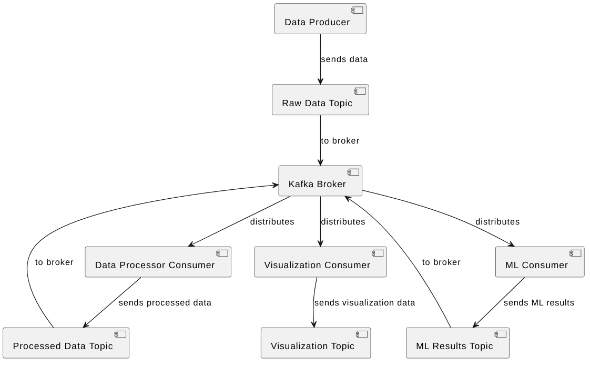

# Kafka for programm language classification

This repository is a solution to the problem of classifying a programming language based on input text using data processing using Kafka.

## Preliminaries

The implemented pipeline corresponds to the picture below, where the methods are released:

* **Visualization Сonsumer**
* **Data Producer**
* **Data processor:** Data Rrocesser Consumer + Processed Data Topic
* **ML processor:** MLConsumer + ML Results Topic
* **Data Post processor:** Data Post Consumer + Data Post-processed Topic



Two modes can be used for **ML processor:**, indicated in the `.env` file under the `ML_PROCESS` parameters:

* `random_sample`: a programming language is randomly selected from a specific list
* `codeberta`: the programming language is predicted by the [huggingface/CodeBERTa-language-id](https://huggingface.co/huggingface/CodeBERTa-language-id) model, which was trained for this task.

## Simulated data collection

To simulate data collection, the [code_search_net](https://huggingface.co/datasets/code_search_net) dataset was used, containing about 1.8 million samples and on which the model from the pipeline was trained.

The pipeline works in such a way that the data is downloaded once, saved in `.json` format locally, and then, with each new launch, the pipeline reads these files and sequentially works with each incoming example.

## Installation

First of all, you need to clone the repository:

```
git clone https://github.com/anyaschenikova/kafka-code-language-classification.git
```

Then you need to run docker-compose:

```
docker-compose up -d
```

Data and dependencies will be pulled up automatically.

## Report

The final expected version of view on Streamlit can be found in [report_pdf](/images/visualization_consumer.pdf).